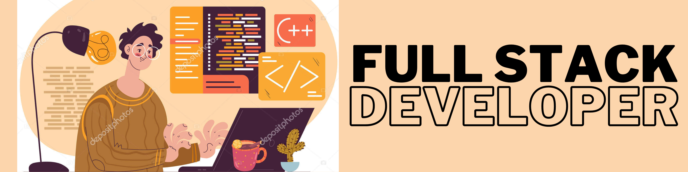

  
  
  

---

I'm the creator of [Amable Conti](https://www.amableconti.com), I'm a Full-stack JavaScript developer, with a passion for creating impactful and
scalable web applications with using latest trends and technolgies. I love
contributing to open-source projects and collaborating with commnunites.
Everyday, I'm improving my skills and trying to become a better version of me.

---

  

  

---

- 🔭 I’m currently working on [Amable Conti](https://www.amableconti.com).